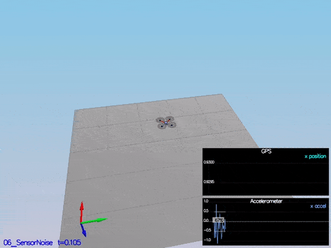
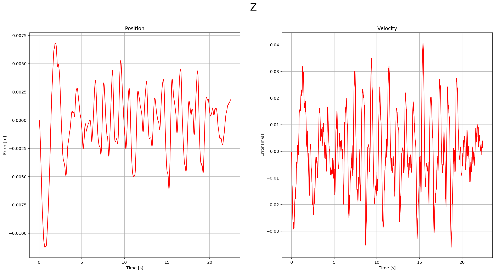
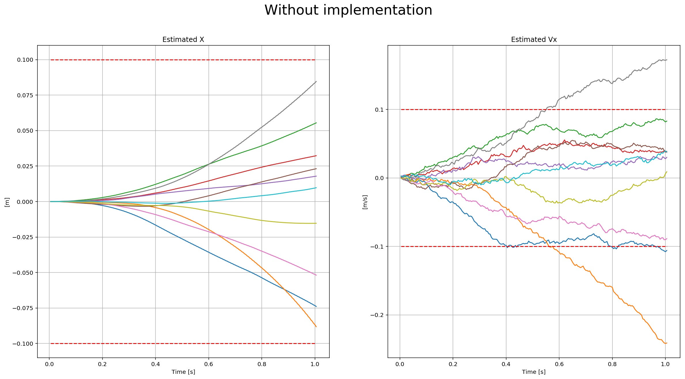
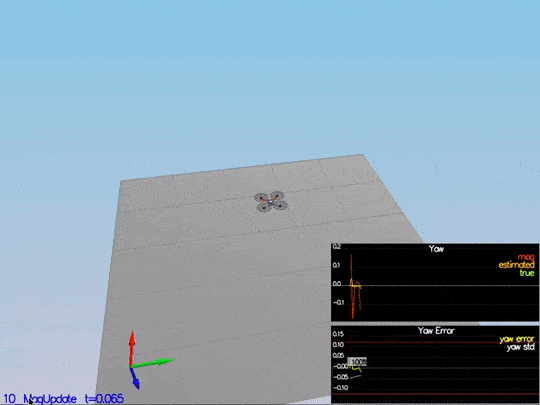
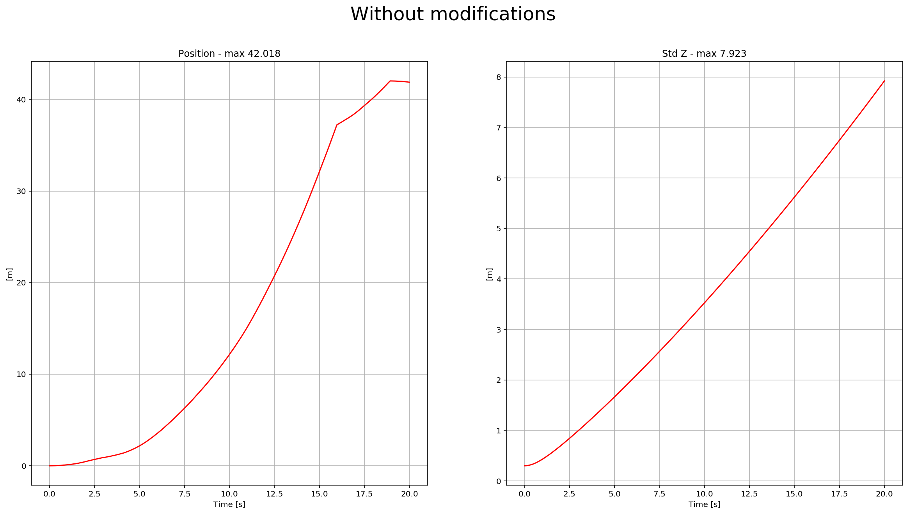
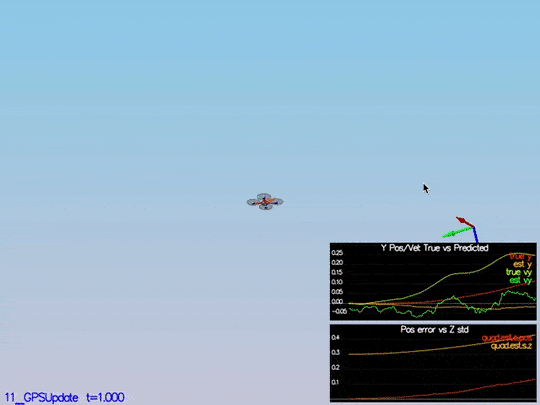
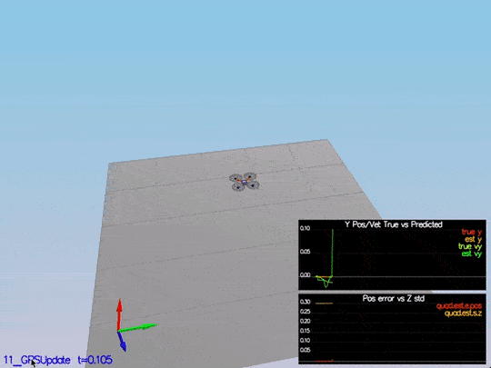
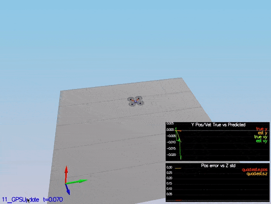

# FCND-Term1-P4-3D-Estimation
Udacity Flying Car Nanodegree - Term 1 - Project 4 - 3D Quadrotor Estimation

The last project of the [Flying Car Nanodegree - Term 1 - Aerial Robotics](https://www.udacity.com/course/flying-car-nanodegree--nd787). This project builds on top of the [control project](https://github.com/reuban-zacker/udacity-school-of-AI/tree/master/Flying%20Car%20Engineer) to get us closer to the reality: noise exists! Using an [Extended Kalman Filter(EKF)](https://en.wikipedia.org/wiki/Extended_Kalman_filter), we need to fusion noisy [GPS](https://en.wikipedia.org/wiki/Global_Positioning_System), [IMU](https://en.wikipedia.org/wiki/Inertial_measurement_unit), and compass(magnetometer) to estimate current drone position, velocity, and yaw. The EKF is implemented using C++ with the code provided by Udacity on the [seed project](https://github.com/udacity/FCND-Estimation-CPP).


The EKF is a very small part of the code base here. Most of the code provided is the drone simulator. The code is the [/src](./src) directory, and the following are the files where the main files we need to change:

- [/config/QuadEstimatorEKF.txt](./config/QuadEstimatorEKF.txt): This file contains the parameters for tuning the EKF. As with the control parameters, we don't need to restart the simulator after parameters modifications. This project is not as heavy as the control project on tuning, but it is good to have this feature.
- [/src/QuadEstimatorEKF.cpp](./src/QuadEstimatorEKF.cpp): This is the EKF implementation. There are sections of the code black to be filled by us.
- [/src/QuadControl.cpp](./src/QuadControl.cpp): This is the cascade PID control implemented on the last project. There is a great implementation in the seed project, but one of the tasks is to use your own; so, it last until the last scenario.
- [/config/QuadControlParams.txt](./config/QuadControlParams.txt): It contains our beloved parameters for the control code. Again, there is a set of these parameters on the seed project. They are not spoilers of the last project tuning pleasure because with them you won't pass the tests there.

# Prerequisites

Nothing extra needs to install, but the IDE is necessary to compile the code. In my case XCode because I am using a Macbook. Please, follow the instructions on the [seed project README.md](https://github.com/udacity/FCND-Estimation-CPP).

# Run the code

The project consists of six scenarios where most of the missing parts of the EKF needs to be implemented and tested.

## Step 1: Sensor noise

It is step 1 here, but this code contains all the code from the control project as well; so, it is scenario `06_SensorNoise`. The simulator will generate two files with GPS and IMU measurements. The task is to process those files and calculate the standard deviation(sigma) for those sensors.



This video is [scenario1.mov](./videos/scenario1.mov).
When the scenario is passing the test, you should see this line on the standard output:

```
PASS: ABS(Quad.GPS.X-Quad.Pos.X) was less than MeasuredStdDev_GPSPosXY for 67% of the time
PASS: ABS(Quad.IMU.AX-0.000000) was less than MeasuredStdDev_AccelXY for 69% of the time
```

The notebook used to calculate this values is [Step 1 Sensor Noise](./visualizations/Step%201%20Sensor%20Noise.ipynb).

## Step 2: Attitude Estimation

In this step, we need to include information from the IMU to the state. There is a few code provided by us there. The only thing we need to do is to integrate `pqr` from the gyroscope into the estimated pitch and roll. The implementation provided linear. The following figure illustrates the data we get with that implementation:


We need to implement a non-linear one to get better results. First, we need to find the roll, pitch and yaw derivates using the following equation from the control lectures:


Once we have the derivates, we can multiply them by `dt` to approximate the integral. The following is a more detail graph after the non-linear integration:


And here is a video of the scenario:


This video is [scenario2.mov](./videos/scenario2.mov).
When the scenario is passing the test, you should see this line on the standard output:

```
PASS: ABS(Quad.Est.E.MaxEuler) was less than 0.100000 for at least 3.000000 seconds
```

## Step 3: Prediction Step

This step has two parts. In the first part, we predict the state based on the acceleration measurement. Without modifying the code, we have this data:



After implementing the first part, you can see the estimation drift:


This is a scenario video:


This video is [scenario3-part1.mov](./videos/scenario3-part1.mov).

The second part we update the covariance matrix and finish the EKF state using the equations on the [Estimation for Quadrotors](https://www.overleaf.com/read/vymfngphcccj#/54894644/) paper provided by Udacity. The important section is `7.2 Transition Model`. The matrixes are big, but it is a matter of being careful when creating them in the code. Without modifying the code, we have this data:



The red-dotted line represents the sigma, and it is not changing over time. After the update of the covariance matrix:


There the dotted line is growing showing sigma growing over time due to the prediction step. Here is a scenario video:


This video is [scenario3-part2.mov](./videos/scenario3-part2.mov).

## Step 4: Magnetometer Update

In this step, we need to update the state with the magnetometer measurement. Without code modifications, we have this data:


To implement the update, we need to use the equations from section `7.3.2 Magnetometer` from the [Estimation for Quadrotors](https://www.overleaf.com/read/vymfngphcccj#/54894644/) paper. After it is implemented, we received this data:


You can see there the yaw error decrease, and the sigma remained stable. Here is a scenario video:



This video is [scenario4.mov](./videos/scenario4.mov). When the scenario is passing the test, you should see this line on the standard output:

```
PASS: ABS(Quad.Est.E.Yaw) was less than 0.120000 for at least 10.000000 seconds
PASS: ABS(Quad.Est.E.Yaw-0.000000) was less than Quad.Est.S.Yaw for 67% of the time
```

## Step 5: Closed Loop + GPS Update

The last step before to finish the EKF implementation: GPS Update. After eliminating the ideal estimator of the code without any code modification, we have this data:



The drone goes wild from time to time as well:



This video is [scenario5-wild.mov](./videos/scenario4-wild.mov).

To implement this update, we need to use the equations from section `7.3.1 GPS` from the [Estimation for Quadrotors](https://www.overleaf.com/read/vymfngphcccj#/54894644/) paper. After it is implemented, we received this data:


We can see there the position error, and sigma decreased. Here is a scenario video:



This video is [scenario5.mov](./videos/scenario5.mov). When the scenario is passing the test, you should see this line on the standard output:

```
PASS: ABS(Quad.Est.E.Pos) was less than 1.000000 for at least 20.000000 seconds
```

## Step 6: Adding Your Controller

The last step! You need to put the control and parameters from the last project and see how it behaves in a noisy scenario. I was lucky enough not to have to tune the control again. I guess the control parameters were "relaxed" already. After adding both files, we received this data:


Here is a scenario video:



This video is [scenario6.mov](./videos/scenario6.mov). When the scenario is passing the test, you should see this line on the standard output:

```
PASS: ABS(Quad.Est.E.Pos) was less than 1.000000 for at least 20.000000 seconds
```

# [Project Rubric](https://review.udacity.com/#!/rubrics/1807/view)

## Writeup

### Provide a Writeup / README that includes all the rubric points and how you addressed each one. You can submit your write-up as markdown or pdf.

This is the write-up.

## Implement Estimator

### Determine the standard deviation of the measurement noise of both GPS X data and Accelerometer X data.

The standard deviation calculation was done with this notebook [Step 1 Sensor Noise](./visualizations/Step%201%20Sensor%20Noise.ipynb) using [numpy](http://www.numpy.org/) `np.std` function. This scenario test output:

```
PASS: ABS(Quad.GPS.X-Quad.Pos.X) was less than MeasuredStdDev_GPSPosXY for 67% of the time
PASS: ABS(Quad.IMU.AX-0.000000) was less than MeasuredStdDev_AccelXY for 69% of the time
```

### Implement a better rate gyro attitude integration scheme in the `UpdateFromIMU()` function.

The implementation of this integration is at [/src/QuadEstimatorEKF.cpp](./src/QuadEstimatorEKF.cpp#L99-L121) from line 99 to line 121. This scenario test output:

```
PASS: ABS(Quad.Est.E.MaxEuler) was less than 0.100000 for at least 3.000000 seconds
```

### Implement all of the elements of the prediction step for the estimator.

The different elements of the predict step are implemented at:

- `PredictState` method: [/src/QuadEstimatorEKF.cpp](./src/QuadEstimatorEKF.cpp#L180-L192) line 180 to line 192.
- `GetRbgPrime` method: [/src/QuadEstimatorEKF.cpp](./src/QuadEstimatorEKF.cpp#L216-L234) line 216 to line 234.
- `Predict` method: [/src/QuadEstimatorEKF.cpp](./src/QuadEstimatorEKF.cpp#L216-L234) line 277 to line 288.

### Implement the magnetometer update.

The magnetometer update is implemented at [/src/QuadEstimatorEKF.cpp](./src/QuadEstimatorEKF.cpp#L341-L353) line 341 to line 353. This scenario test output:

```
PASS: ABS(Quad.Est.E.Yaw) was less than 0.120000 for at least 10.000000 seconds
PASS: ABS(Quad.Est.E.Yaw-0.000000) was less than Quad.Est.S.Yaw for 67% of the time
```

### Implement the GPS update.

The GPS update was implemented at [/src/QuadEstimatorEKF.cpp](./src/QuadEstimatorEKF.cpp#L310-L322) line 310 to line 322. This scenario test output:

```
PASS: ABS(Quad.Est.E.Pos) was less than 1.000000 for at least 20.000000 seconds
```

## Flight Evaluation

### Meet the performance criteria for each step.

The code meets all the performance criteria. There are samples of each scenario test output on the above rubric points.

### De-tune your controller to successfully fly the final desired box trajectory with your estimator and realistic sensors.

After adding last project control parameters and controller, the drone successfully executes the trajectory.
